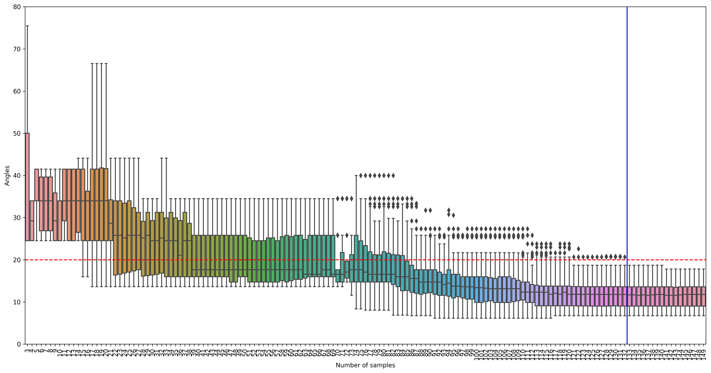
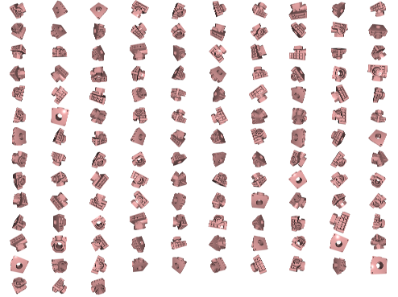

# Minimum_SO3_Sampler

Uniformly sample points in the SO(3) space, ensuring that each rotation is within a specific range of angles from its nearest neighbor.

## Introduction

The purpose of this repository is to basically calculate the minimum number of position data sets required for 6D position estimation.

It is assumed that deep learning-based or point cloud registration algorithms know the convergence range for rotation errors that may converge. 
This code calculates the minimum number of samples so that all points are located within the corresponding convergence range through uniform sampling in SO(3) space.

This repository is based on [Generating Uniform Incremental Grids on SO(3) Using the Hopf Fibration](https://lavalle.pl/software/so3/so3.html).

## Prerequisites

### Install required libraries

```bash
pip install -r requirements.txt
```

## Run the file

### Run file command

- SO(3) Calculate the minimum number of samples in which the distribution of rotation angle to rotate to adjacent points for all points (representing rotation) in space is within a specific angle

```bash
python3 optimal_pose_samples.py
```

- Save the image after rendering the object to the optimal number of pose samples

<div align=center></div>

```bash
python3 pose_vis.py
```

<div align=center></div>

- Verify that the number of samples is really optimal and calculate the probability of convergence

```abash
# Under construction
python3 convergence_test.py
```
